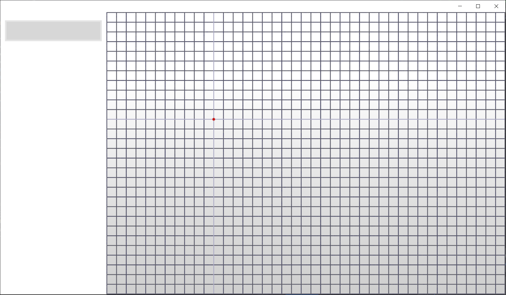
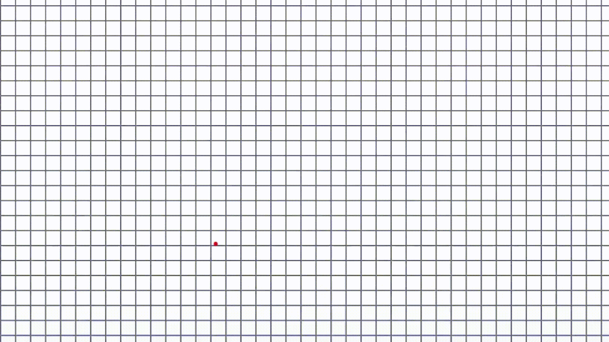

# Drawing GUI 
**Version 1.0.0**

---
### Description

Graphical User Interface that allows for drawing and editing of polygons.

This project was undertaken as a challenge to create a GUI without using tkinter or other GUI packages.

---
### Screenshots

---
### License & copyright

© 2022 Peter Booth